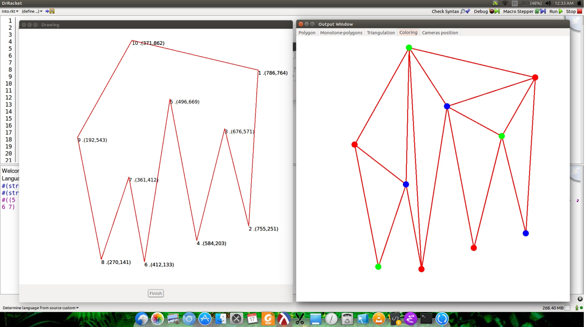
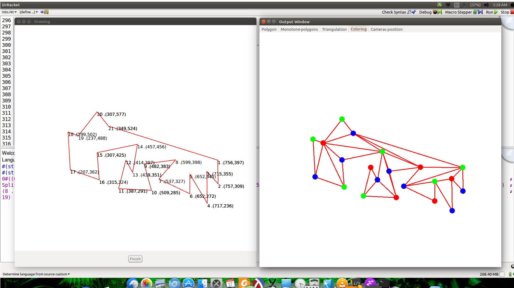

# Art-Gallery-Problem
A complete UI + backend program to find approximate solutions to the Art Gallery Problem

### Problem Desciption
Art Gallery Problem : 
Given the layout (map) of an art gallery what is the minimum number of stationary guards (CC TV cameras) needed to guard every point in the art gallery

For more about Art Gallery Problem :
https://en.wikipedia.org/wiki/Art_gallery_problem
Also i have included the books we used for searching the algorithms to solve the problem.

### Guide for running
So to begin and explore art gallery theorom and it's algorithm

* Install the DrRacket IDE.

* Open the file begin.rkt. Run the program, enter number of sides of Polygon, give input of polygon using a plotting window as points in CLOCKWISE order to obtain triangulations of polygon and you'll get in return the minimum number of cameras along with their location.

Here are screenshots of our program working

The user draws the input as shown in the left, and the program outputs in a new window (the left one), a triangulation of the polygon with a three coloring of the vertices. Now pick any one color and add cameras at those vertices

### Design of program
We have created a main file with canvas package of racket. On running the file we get input window in which user can
give input to the polygon by marking points on screen. Program takes points as input and opens the output window
with tabs corresponding to triangulation, monotone partition, colouring and camera position. We have created objects
corresponding to a polygon to which we call monotoning partitioning function. New monotone polygon is instantiated
in separate monotone class inherited from polygon class. Monotone polygon is triangulated to give us triangle.
Triangle is instance of node class inherited from monotone class

### Outline of algorithm
* We first break our polygon into monotone polygons. to do so we first identify the vertices that causes the nonmonotonicity of the polygon and then we resolve them accordingly. We simply iterate through the vertices of polygon
and break it into monotone polygons.

* After partitioning our polygon Into monotone polygons we triangulate each polygon separately by chopping of
triangles one by one and then recursively calling the function on remaining polygon .

* We then make a graph whose vertexes (of graph ,not polygon) are the triangles and two vertexes are joined by an
edge(of graph ,not polygon) if they share a side in common

* We then run a depth-first-search on the graph and in this process we go to each vertex of the graph (that is each
triangle) and colour the vertices by three different colours. This results in a three colouring of a graph whose vertices
are the vertices of the polygon and whose edges are the edges of the the graph.

* After three colouring of the polygon we identify the colour that is used least no of times and identify the vertices of
the polygon that were coloured by this colour ,placing cameras at these vertices provides the solution of our problem.
